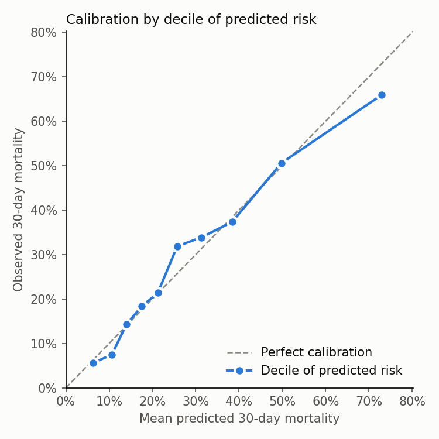

# OncoAI: Oncology ICU Outcomes & Risk Stratification

Which critically ill cancer patients are most likely to die within 30 days of ICU admission, and can the first 48 hours of routine labs and vitals flag them?
This repo answers that question on MIMIC-III. The work runs from cohort definition through curated, tested data tables to outcome measures, a risk model and a one-page brief.

**[Live dashboard](https://oncoai-db.streamlit.app)** · **[Executive brief](docs/executive_brief.md)** · **[Full results report](reports/quality_measures.md)** · **[Business rules](docs/business_rules.md)**

> For research and education only. Not for clinical decision-making.

## Results at a glance

**Cohort:** 2,671 adults with cancer whose first ICU stay lasted at least 48 h. 765 of them (28.6%) died within 30 days.

| Cancer group | Stays | 30-day mortality |
| :-- | --: | --: |
| Solid tumor, metastatic | 1,171 | 35.9% |
| Solid tumor, non-metastatic | 937 | 19.3% |
| Hematologic | 563 | 29.1% (acute leukemia alone: 40.7%) |

**Risk model:** on 535 held-out patients, ROC-AUC is **0.768** (95% CI 0.722–0.812), against 0.549 for age alone. It is well calibrated (calibration slope 1.04).

**Risk tiers:** sorting patients into thirds by predicted risk separates outcomes clearly.

| Tier | Observed 30-day mortality | Predicted |
| :-- | --: | --: |
| Low | 9.8% | 10.9% |
| Medium | 26.4% | 23.8% |
| High | 49.8% | 51.6% |

**Where the model falls short:** it under-predicts deaths for metastatic disease (observed/predicted 1.18) and lung cancer (1.31). Cancer stage isn't among its inputs.



## Study design

### Cohort selection

| Step | Rule | Why |
| :-- | :-- | :-- |
| Cancer | The admission carries a **Charlson malignancy** ICD-9-CM code (Quan 2005): 140–172, 174–195.8, 200–208, or metastatic 196–199.1. Malignant neuroendocrine codes (209.0–209.3, 209.7) are also included | A standard, published code set. Non-melanoma skin cancer (173), in-situ, benign and uncertain-behavior codes are excluded |
| One stay per patient | The patient's first ICU stay | Keeps observations independent |
| Adults | Age 18–89 | MIMIC shifts ages over 89 |
| At least 48 h in the ICU | `outtime − intime ≥ 48 h` | The 48 h feature window must close before the outcome can happen in the ICU. This matches the standard MIMIC-III mortality benchmark |

**Outcome:** death within 30 days of ICU admission, including deaths after discharge. This avoids counting patients discharged to hospice as survivors.

**Reporting groups:** hematologic (any 200–208 code), then metastatic solid, then non-metastatic solid. This is how critical-care oncology studies compare outcomes.

Full code tables, edge cases and references are in [docs/business_rules.md](docs/business_rules.md).

### Features and model

- **Inputs:** labs and vitals from the first 48 h of the ICU stay, summarized per measurement as mean, min, max and hourly slope (26 measurements).
  Measurements present in fewer than 80% of stays are dropped.
- **Feature selection:** XGBoost ranks the features by mean |SHAP|, using the training split only, and keeps the top 10.
- **Model:** standardized logistic regression, chosen so each prediction can be explained with SHAP in the dashboard.
- **Selected features:** BUN (min, mean), creatinine (mean), MCHC (mean, max), anion gap (mean), bicarbonate slope, RDW (min), heart rate (max) and age.
- **Diagnosis codes are never predictors.** MIMIC assigns them at discharge, after the prediction time.

### Evaluation

| Check | Result |
| :-- | :-- |
| Held-out test set (20%, split by patient) | ROC-AUC 0.768; PR-AUC 0.584 at 28.6% prevalence; Brier score 0.164 |
| Age-only baseline on the same test set | ROC-AUC 0.549 |
| 5-fold grouped cross-validation (training split) | ROC-AUC 0.740 ± 0.019 |
| Cross-fitted predictions for all 2,671 stays | ROC-AUC 0.752. These feed the risk tiers and subgroup calibration, so every stay is scored by a model that never saw that patient |

Imputation, feature selection and fitting happen inside each training split or fold, never on test rows.

**What the subgroup comparisons are not:** observed/predicted ratios here measure the *model's* calibration in a subgroup. They are not standardized mortality ratios, because the model doesn't adjust for case mix (admission type, comorbidity, code status).
Mortality differences between ICUs therefore are not quality rankings. [Business rules §6](docs/business_rules.md#why-this-is-not-a-standardized-mortality-ratio) explains what a proper case-mix model would need.

## How it works

```text
MIMIC-III (PostgreSQL)
  │  SQL: cohort view + 48 h lab/vital extraction views
  ▼
feature_engineering.py ─► model_training.py ─► models/ (model, scaler, features, metrics)
                                │                  └─► Streamlit dashboard (risk + SHAP)
                                └─► cross-fitted risk per stay
                                          │
dbt (DuckDB, Postgres read-only) ◄────────┘
  seeds → staging → intermediate → marts, with data tests
  ▼
run_quality_report.py ─► reports/quality_measures.md + figures (aggregates only)
```

**Stack:** PostgreSQL, SQL, DuckDB, dbt, pandas, scikit-learn, XGBoost, SHAP, MLflow, Streamlit. **Standards:** ICD-9-CM (Charlson code sets), LOINC.

## Data quality

The dbt project builds curated tables with automated tests:

- **Analytic table:** one row per stay with outcomes, length of stay and readmission.
- **Data dictionary:** every lab and vital item, with its units and LOINC code.
- **Data-health monitor:** coverage and implausible-value rates by ICU type and documentation system.

The tests check:
- keys, ranges and allowed values;
- that every measurement falls inside the 48 h window;
- that the cohort rule and the cancer-category table agree;
- that every feature-eligible measurement is LOINC-coded;
- that readmission is defined only for ICU survivors.

**What the checks caught:** the original cohort filter matched diagnosis titles containing "malignant" or "neoplasm".
- **It included 390 benign or pre-cancerous stays.**
- **It missed 387 stays with leukemia, lymphoma, myeloma or melanoma**, whose titles use neither word.

Switching to the Charlson code set fixed both errors and raised measured 30-day mortality from 25.1% to 28.6%.

**Privacy:** no MIMIC data is in this repo, raw or derived. Published files are model coefficients and aggregate tables, and any count between 1 and 10 is suppressed.

## Reproduce

You need Python 3.11, Poetry, PostgreSQL, and [credentialed MIMIC-III v1.4 access](https://physionet.org/content/mimiciii/1.4/).

```bash
poetry install
cp .env.example .env        # set ONCOAI_POSTGRES_CONN_STR (a read-only role is enough)

# Load MIMIC and build the cohort views (as the postgres superuser)
psql -U postgres -d mimic-iii -v mimic_dir="$PWD/data/raw/mimic-iii-full" -f src/oncoai_prototype/data_loading/01_mimic-iii_dataload.sql
for f in 02_define_onco_cohort 03a_extract_all_labs_48h 03b_extract_all_vitals_48h; do
  psql -U postgres -d mimic-iii -f src/oncoai_prototype/data_loading/$f.sql
done
psql -U postgres -d mimic-iii -c "GRANT SELECT ON oncology_icu_base, all_labs_48h, all_vitals_48h TO <app_role>;"

# Features, model, curated tables, report
poetry run python -m oncoai_prototype.data_processing.feature_engineering
poetry run python -m oncoai_prototype.modeling.model_training
set -a; source .env; set +a
(cd dbt && poetry run dbt deps && poetry run dbt build)
poetry run python -m oncoai_prototype.analytics.run_quality_report

# Tests (-m db runs the checks against the database) and the dashboard
poetry run pytest -q && poetry run pytest -q -m db
ONCOAI_MODE=mlflow poetry run streamlit run streamlit_app/onco_dashboard.py
```

**Deployment:** the live dashboard runs on Streamlit Community Cloud. It downloads `models/` from `main`, so pushing retrained model files redeploys it.

## Repository layout

```text
src/oncoai_prototype/
  data_loading/      SQL: MIMIC load, cohort, 48 h extraction
  data_processing/   feature engineering
  modeling/          training, cross-fitting, batch prediction
  analytics/         outcome summaries, risk tiers, calibration, small-cell suppression, report
dbt/                 seeds, staging/intermediate/mart models, data tests
docs/                business rules, executive brief
reports/             results report and figures (aggregate only)
models/              published model files (see models/README.md)
streamlit_app/       dashboard
tests/               unit tests (synthetic data) and database tests
```

## Limitations

- One hospital (Beth Israel Deaconess, 2001–2012), with no external validation.
- Diagnosis codes don't capture cancer stage, treatment or code status. They are assigned at discharge, with no present-on-admission flag.
- Requiring a 48 h ICU stay excludes the earliest deaths.
- Mortality by ICU type is not risk-adjusted.

## History

Earlier versions reported ROC-AUC 0.842. That figure was inflated by duplicated ICU stays across train and test, feature selection that saw test rows, and a cohort whose outcome could fall inside the feature window, so it has been retired.
An October 2026 review fixed those problems, reloaded vitals with full timestamps, and removed MIMIC-derived files from the git history. A later clinical review moved the cohort to the Charlson code set.
The details are in [docs/business_rules.md](docs/business_rules.md#change-record-october-2026-cohort-correction).

## License and citation

The MIT License ([LICENSE](LICENSE)) covers this code only. MIMIC-III is governed by the PhysioNet Credentialed Health Data License 1.5.0. If you use this work, please cite:

- Johnson AEW, et al. MIMIC-III, a freely accessible critical care database. *Sci Data* 3, 160035 (2016). https://doi.org/10.1038/sdata.2016.35
- Johnson A, Pollard T, Mark R. MIMIC-III Clinical Database (v1.4). *PhysioNet* (2016). https://doi.org/10.13026/C2XW26
- Goldberger AL, et al. PhysioBank, PhysioToolkit, and PhysioNet. *Circulation* 101(23):e215–e220 (2000).
