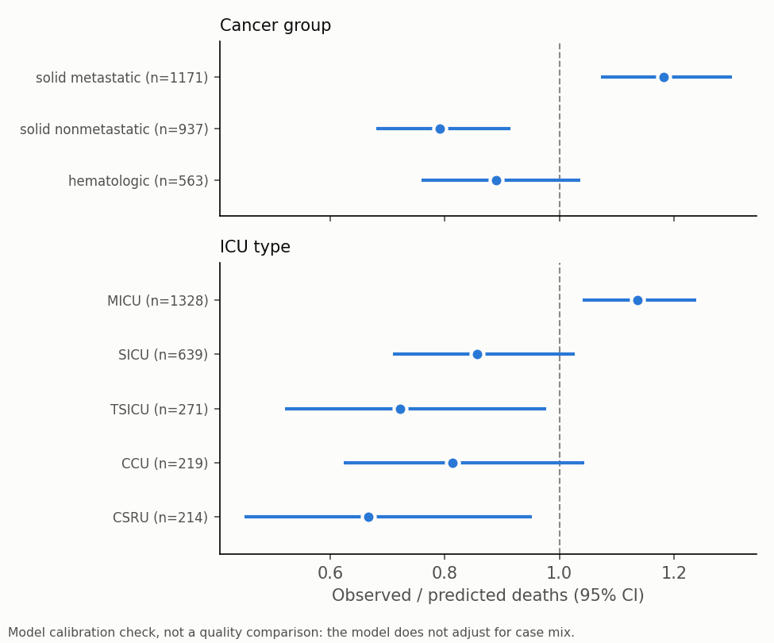

# Outcomes, utilization and risk stratification: oncology ICU cohort

Generated 2026-10-06 by `python -m oncoai_prototype.analytics.run_quality_report` from the dbt
marts. Aggregates only; any count between 1 and 10 (and any rate that would reveal it) is suppressed (`<11`).
Definitions are in [docs/business_rules.md](../docs/business_rules.md).

**Cohort:** 2,671 first ICU stays of at least 48 h in adults with a malignancy;
765 died within 30 days of ICU admission (28.6%).

## 1. Outcomes and utilization by cancer group

Hematologic: any lymphoma, leukemia or myeloma code (31 of these also carry a solid-tumor code). Solid
metastatic: secondary or disseminated disease coded (Charlson definition). Length of stay is split by survival to
hospital discharge, because death shortens a stay. ICU readmission is the SCCM indicator: return to an ICU within 48 h
in the same hospitalization, among patients discharged alive from the ICU.

| cancer_group | n | deaths_30d | mortality_30d_rate | icu_deaths | icu_los_survivors | icu_los_decedents | hosp_los_survivors | hosp_los_decedents | icu_survivors | readmit_48h_rate |
|---|---|---|---|---|---|---|---|---|---|---|
| hematologic | 563 | 164 | 29.1% | 96 | 3.9 | 6.0 | 12.6 | 17.1 | 467 | 2.6% |
| solid_metastatic | 1171 | 420 | 35.9% | 208 | 3.5 | 5.0 | 10.0 | 8.8 | 963 | 1.8% |
| solid_nonmetastatic | 937 | 181 | 19.3% | 99 | 3.5 | 5.9 | 10.4 | 8.8 | 838 | 2.4% |

### Hematologic subtypes

Acute leukemia (any acute leukemia code), then lymphoma, myeloma and chronic leukemia, first match wins.

| heme_subtype | n | deaths_30d | mortality_30d_rate | icu_deaths |
|---|---|---|---|---|
| lymphoma | 287 | 73 | 25.4% | 43 |
| acute_leukemia | 118 | 48 | 40.7% | 30 |
| chronic_leukemia | 83 | 24 | 28.9% | 12 |
| myeloma | <11 | <11 | <11 | <11 |
| other_hematologic | <11 | <11 | <11 | <11 |

### By ICU type

| first_careunit | n | deaths_30d | mortality_30d_rate | icu_deaths | icu_los_survivors | icu_los_decedents | hosp_los_survivors | hosp_los_decedents | icu_survivors | readmit_48h_rate |
|---|---|---|---|---|---|---|---|---|---|---|
| MICU | 1328 | 513 | 38.6% | 279 | 3.7 | 5.0 | 10.2 | 9.2 | 1049 | 2.1% |
| SICU | 639 | 118 | 18.5% | 53 | 3.8 | 5.9 | 11.2 | 11.4 | 586 | <11 |
| TSICU | 271 | 42 | 15.5% | 23 | 3.7 | 6.6 | 11.5 | 10.0 | 248 | <11 |
| CCU | 219 | 62 | 28.3% | 29 | 3.6 | 7.4 | 8.9 | 12.0 | 190 | <11 |
| CSRU | 214 | 30 | 14.0% | 19 | 3.3 | 7.6 | 9.5 | 10.2 | 195 | <11 |

These are observed rates. They are **not risk-adjusted**: units differ in who they admit (for example, medical vs
post-operative patients), so differences between rows describe case mix as much as care.

## 2. Risk stratification

Tiers are tertiles of cross-fitted predicted risk (low < 17.0% ≤ medium < 32.3% ≤ high). They are
descriptive. A tier meant to trigger an action, such as a goals-of-care conversation, needs a threshold agreed with
clinicians.

| risk_tier | n | deaths | observed_rate | mean_predicted |
|---|---|---|---|---|
| low | 897 | 88 | 9.8% | 10.9% |
| medium | 882 | 233 | 26.4% | 23.8% |
| high | 892 | 444 | 49.8% | 51.6% |

## 3. Model calibration by subgroup

Observed ÷ predicted deaths, with Byar's 95% CI. **This checks the model; it is not a standardized mortality ratio.**
The model's inputs are first-48 h labs and vitals plus age (10 features, listed in models/feature_names.txt). It has no admission type, comorbidity, cancer group or stage, or code status.
A ratio above 1 means the model under-predicts for that group, usually because something it can't see (such as metastatic
disease) carries risk.

### By cancer group

| cancer_group | n | observed | predicted | observed_rate | predicted_rate | obs_pred_ratio | ci_low | ci_high | calibration |
|---|---|---|---|---|---|---|---|---|---|
| solid_metastatic | 1171 | 420 | 355.2 | 35.9% | 30.3% | 1.18 | 1.07 | 1.30 | model under-predicts |
| solid_nonmetastatic | 937 | 181 | 228.9 | 19.3% | 24.4% | 0.79 | 0.68 | 0.91 | model over-predicts |
| hematologic | 563 | 164 | 184.3 | 29.1% | 32.7% | 0.89 | 0.76 | 1.04 | consistent |

### By primary site

| primary_site | n | observed | predicted | observed_rate | predicted_rate | obs_pred_ratio | ci_low | ci_high | calibration |
|---|---|---|---|---|---|---|---|---|---|
| digestive | 644 | 157 | 170.9 | 24.4% | 26.5% | 0.92 | 0.78 | 1.07 | consistent |
| hematologic | 548 | 162 | 179.9 | 29.6% | 32.8% | 0.90 | 0.77 | 1.05 | consistent |
| respiratory_thoracic | 491 | 188 | 143.0 | 38.3% | 29.1% | 1.31 | 1.13 | 1.52 | model under-predicts |
| unknown_primary | 459 | 164 | 149.2 | 35.7% | 32.5% | 1.10 | 0.94 | 1.28 | consistent |
| genitourinary | 281 | 54 | 73.4 | 19.2% | 26.1% | 0.74 | 0.55 | 0.96 | model over-predicts |
| cns_and_eye | 88 | 12 | 16.2 | 13.6% | 18.4% | 0.74 | 0.38 | 1.30 | consistent |
| bone_soft_tissue_melanoma | <11 | <11 | <11 | <11 | <11 | <11 | – | – | suppressed (small cell) |
| breast | <11 | <11 | <11 | <11 | <11 | <11 | – | – | suppressed (small cell) |
| head_and_neck | <11 | <11 | <11 | <11 | <11 | <11 | – | – | suppressed (small cell) |
| other_solid | <11 | <11 | <11 | <11 | <11 | <11 | – | – | suppressed (small cell) |
| neuroendocrine | <11 | <11 | <11 | <11 | <11 | <11 | – | – | suppressed (small cell) |

### By ICU type

| first_careunit | n | observed | predicted | observed_rate | predicted_rate | obs_pred_ratio | ci_low | ci_high | calibration |
|---|---|---|---|---|---|---|---|---|---|
| MICU | 1328 | 513 | 451.4 | 38.6% | 34.0% | 1.14 | 1.04 | 1.24 | model under-predicts |
| SICU | 639 | 118 | 137.7 | 18.5% | 21.6% | 0.86 | 0.71 | 1.03 | consistent |
| TSICU | 271 | 42 | 58.1 | 15.5% | 21.5% | 0.72 | 0.52 | 0.98 | model over-predicts |
| CCU | 219 | 62 | 76.2 | 28.3% | 34.8% | 0.81 | 0.62 | 1.04 | consistent |
| CSRU | 214 | 30 | 45.0 | 14.0% | 21.0% | 0.67 | 0.45 | 0.95 | model over-predicts |

## 4. Data health

**LOINC coverage:** 95% of the 325 lab items in the 48 h window carry a
LOINC code from MIMIC's lab dictionary, including 100% of the 28 labs
recorded in ≥ 70% of stays. MIMIC-III chart items have no LOINC; a verified crosswalk covers the
6 chart items the model can use (of 1029 seen).

**Items recorded in more than one unit** (ignoring case): 9.

| source | itemid | label | units | n_stays |
|---|---|---|---|---|
| lab | 51514 | Urobilinogen | EU/dL, mg/dL | 243 |
| lab | 51274 | PT | SECONDS, sec | 2362 |
| lab | 51128 | WBC, Ascites | #/CU MM, #/uL | 33 |
| lab | 50926 | Follicle Stimulating Hormone | mIU/L, mIU/mL | <11 |
| lab | 50964 | Osmolality, Measured | MOSM/KG, MOSM/L, mOsm/kg | 154 |
| lab | 50958 | Luteinizing Hormone | mIU/L, mIU/mL | <11 |
| lab | 51127 | RBC, Ascites | #/uL, #/CU MM | 30 |
| lab | 50993 | Thyroid Stimulating Hormone | uU/ML, uIU/mL | 236 |
| lab | 50889 | C-Reactive Protein | mg/L, mg/dL | 23 |

**Monitor flags** (coverage ≥ 15 points from the cohort rate, or > 1% implausible values):

None.

2 further flag(s) involve fewer than 11 stays and are not shown; triage notes are in docs/business_rules.md §5.
